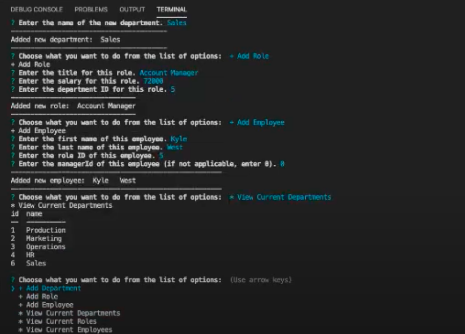

# Employee Tracker

## Description

A CLI application that allows users to view and interact with employee information stored in databases. Users can add, view, and delete department, role and employee info, as well as update existing employee roles. This helps employers manage and organize their company's employee information.

## Table of Contents

* [Installation](#Installation)
* [Usage](#Usage)
* [Tests](#Tests)
* [Questions](#Questions)
* [License](#License)

## Installation

Install node and node packages: MySQL, Inquirer and console.table.

## Usage

In terminal, run "node app.js" and a list of options will be at your disposal. Each option prompts specific questions relative to the action. After adding, updating or deleting anything, you can select "View 'sectionName'" to see the new changes. Select == END APPLICATION == when you're finished.

Link to Demo Video: <https://youtu.be/8VyuB69p1lI>

## Tests

If there are errors with the update and delete options, run this code in your MySQL workbench:

SET SQL_SAFE_UPDATES = 0;

## Questions

* Github: <https://github.com/andrewyen64>

* Email: andrewyen64@gmail.com

## License

GNU_v3.0 License

Copyright © 2020 Andrew Yen

[Link to License](LICENSE)
